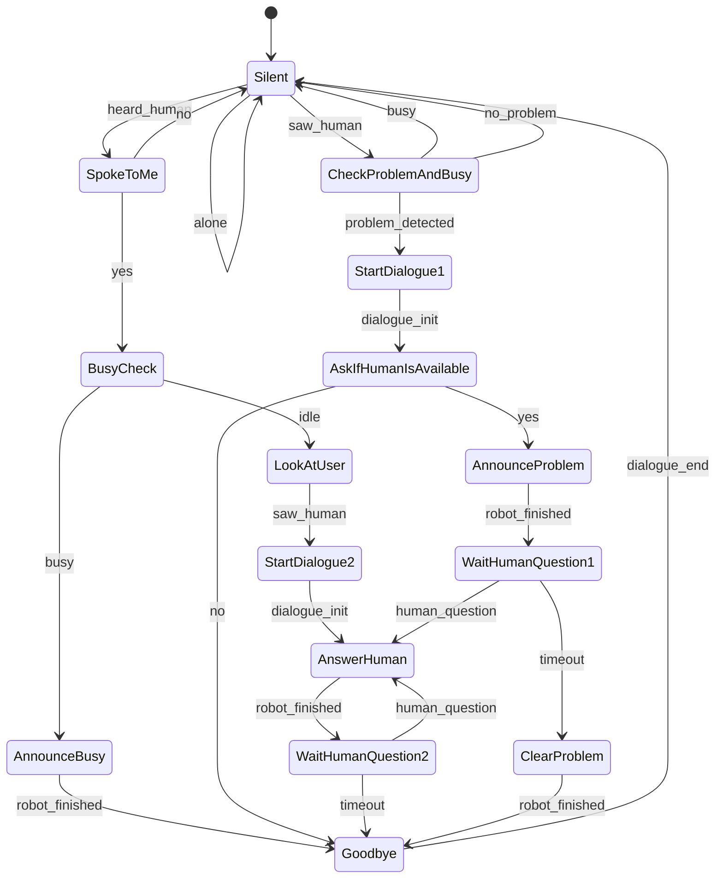

# Physical AI for sequential dialogue generation
---


Team Members:
- Tomasz Koczar
- Anastasiya Bazyk
- Yehor Kuzmych

**Aim:** Replacing current `hardcodeed` dialog flow with LLM based solution.


Starting issues:
- No documentation
- No instructions on how to run the code
- Code coverage with unit tests is low

---
## Current State Machine

```python
plantroid_dialogue_state_machine = StateMachine("dialogue", ["Silent","SpokeToMe", "BusyCheck",
                                                             "LookAtUser", "AnnounceBusy", "StartDialogue2",
                                                             "AnswerHuman", "WaitHumanQuestion1", "CheckProblemAndBusy",
                                                               "StartDialogue1", "Goodbye", "AskIfHumanIsAvailable",
                                                               "AnnounceProblem", "WaitHumanQuestion2", "ClearProblem"],
                                                            ["alone", "dialogue_end", "saw_human", "heard_human",
                                                             "yes","no", "no_problem", "busy", "idle", "problem_detected",
                                                             "dialog_init", "human_question", "robot_finished", "timeout"],
                                                            {"Silent":{"alone":"Silent",
                                                                       "saw_human":"CheckProblemAndBusy",
                                                                       "heard_human":"SpokeToMe",
                                                                       },
                                                             "SpokeToMe":{"no":"Silent",
                                                                          "yes":"BusyCheck",
                                                                          },
                                                             "BusyCheck":{"idle":"LookAtUser",
                                                                          "busy":"AnnounceBusy",},
                                                             "LookAtUser":{"saw_human":"StartDialogue2",},
                                                             "AnnounceBusy":{"robot_finished":"Goodbye",},
                                                             "StartDialogue2":{"dialogue_init":"AnswerHuman",},
                                                             "AnswerHuman":{"robot_finished":"WaitHumanQuestion2",},
                                                             "WaitHumanQuestion1":{"human_question":"AnswerHuman",
                                                                                   "timeout":"ClearProblem",},
                                                             "CheckProblemAndBusy":{"busy":"Silent",
                                                                                    "no_problem":"Silent",
                                                                                    "problem_detected":"StartDialogue1"},
                                                             "StartDialogue1":{"dialogue_init":"AskIfHumanIsAvailable",},
                                                             "Goodbye":{"dialogue_end":"Silent",},
                                                             "AskIfHumanIsAvailable":{"yes":"AnnounceProblem",
                                                                                      "no":"Goodbye",},
                                                             "AnnounceProblem":{"robot_finished":"WaitHumanQuestion1",},
                                                             "WaitHumanQuestion2":{"human_question":"AnswerHuman",
                                                                                   "timeout":"Goodbye",},
                                                             "ClearProblem":{"robot_finished":"Goodbye",}} )

```




---

```
Silent ──heard──> SpokeToMe ──yes──> BusyCheck ──idle──> LookAtUser
  │                                                            │
  │                                                      saw_human
  │                                                            │
  └──saw_human──> CheckProblemAndBusy                         ▼
                         │                            StartDialogue2
                   problem_detected                            │
                         │                              dialogue_init
                         ▼                                     │
                  StartDialogue1                               ▼
                         │                               AnswerHuman ◄───┐
                  dialogue_init                                │         │
                         │                            robot_finished     │
                         ▼                                     │         │
               AskIfHumanIsAvailable                           ▼         │
                    │         │                    WaitHumanQuestion1/2  │
                   yes       no                            │              │
                    │         │                      human_question──────┘
                    ▼         ▼                            │
             AnnounceProblem  Goodbye ◄──────timeout───────┘
                    │              │
            robot_finished   dialogue_end
                    │              │
                    ▼              ▼
            WaitHumanQuestion1   Silent
```

---


# Low-hanging fruits found (easy to improve):

## Question Detection:

```python
def question_detection(phrase):
    words = word_tokenize(phrase)
    pos_tags = pos_tag(words)
    if phrase.strip().endswith('?'):
        return True
    wh_words = {'what', 'who', 'whom', 'where', 'when', 'why', 'how', 'which'}
    aux_verbs = {'is', 'are', 'am', 'was', 'were', 'do', 'does', 'did', 'will', 'would', 'can', 'could', 'should', 'have', 'has', 'had'}
    if words[0].lower() in wh_words or words[0].lower() in aux_verbs:
        return True
    # Check if the first verb comes before the subject (e.g., "Is the cat hungry?")
    for i, (word, tag) in enumerate(pos_tags):
        if tag.startswith('VB'):  # Verb
            if i < len(pos_tags) - 1 and pos_tags[i+1][1].startswith('NN'):  # Noun following the verb
                return True
    # If none of the conditions are met, it's likely not a question
    return False

```

## Question Awnsering

```python
    def conversate(self, data, response_emotion):
        gib = chatter(data)
        #human_content_emotion = GPTJ(data, port=5052)
        #print(content_emotion)
        addendum = response_emotion
        if gib is None:
            gib = self.get_llm_response(data)
        else:
            if "wikipedia:" in gib:
                gib = gib.split(":")[1]
                gib = utils.wikipedia_query(gib)
                gib = "Paraphrase the following sentence"+addendum+": "+gib
                gib = self.get_llm_response(gib)
            elif "dictionary:" in gib:
                gib = gib.split(":")[1]
                gib = utils.dictionary_query(gib)
                gib = "Paraphrase the following sentence"+addendum+": "+gib
                gib = self.get_llm_response(gib)
            elif "sensor:" in gib:
                split = gib.split(":")
                sensor_reading = self.get_sensor(int(split[1]))
                sensor_dict = {0:"right ear light", 1:"tail light",
                               2:"left ear light", 3:"soil moisture", 4:"temperature",
                               5:"None", 6:"Salinity", 7:"pH", 8:"Nitrogen", 9:"Phosphorus", 10:"Potassium"}
                unit_dict = {0:"lux", 1:"lux",2:"lux", 3:" per cent", 4:" Degrees Celsius", 5:"",
                             6:" deciSiemes per centimeter", 7:"", 8:" miligrams per kilogram of soil",
                             9:" miligrams per kilogram of soil", 10:" miligrams per kilogram of soil"}
                gib = "current "+sensor_dict[int(split[1])]+" sensor reading is "+str(sensor_reading)+unit_dict[int(split[1])]
                gib = "Paraphrase the following sentence"+addendum+": "+gib
                gib = self.get_llm_response(gib)
            elif gib == "vision_check":
                gib = self.get_vision()
                gib = "Paraphrase the following sentence"+addendum+": "+gib
                gib = self.get_llm_response(gib)
            elif gib =="not_proc":
                gib = process_notifications(self.notifications)
                print(gib)
                gib = "Paraphrase the following sentence"+addendum+": "+gib
                gib = self.get_llm_response(gib)
                self.notifications = {}
        self.set_face(response_emotion)
        return gib
```

---
## Hardcoded pairs

```python
default_pairs = [
[
  r"(hi|hello|howdy|salutations|oy|oi|hola) (.*)",
  ["Hello!","Hi!","Hello, my friend!"]
],
[
  r"my name is (.*)",
  ["Hello %1, How are you today",]
],
[
  r"what is your name",
  ["My name is Plantroid!","I'm called Plantroid!","My friends call me Plantroid!",]
],
[
  r"who are you",
  ["I'm Plantroid!","My creator told me I am Plantroid","I am the amazing plant carrying robot Plantroid!"]
],
[
  r"do you love humans",
  ["yes!"]
],
[
  r"do you need food",
  ["no!"]
],
[
  r"how are you",
  ["Great as always! how about you ?",]
],
[
  r"sorry (.*)",
  ["Its alright","Its OK, never mind",]
],
[
  r"hi|hey|hello",
  ["Hello", "Hey there","Hi!"]
],
[
  r"(.*) age?",
  ["I'm a robot, so, I don't know.",]
],
[
  r"what (.*) want",
  ["Make me an offer I can't refuse",]
],
[
  r"(.*) created",
  ["Antonio Galiza created me!","top secret",]
],
[
  r"(.*) (location|city)",
  ['Tokyo, Japan',]
],
[
  r"how is weather in (.*)",
  ["Weather in %1 is awesome like always","Too hot here in %1","Too cold here in %1","I don't know where 1% is."]
],
[
  r"i work in (.*)",
  ["%1 is an Amazing company", "I have heard about it", "Cool!",]
],
[
  r"(.*)raining in (.*)",
  ["No rain since last week here in %2","Damn its raining too much here in %2"]
],
[
  r"(.*) (sports|game)",
  ["I was a robot soccer player in robot school.",]
],
[
  r"who (.*) (moviestar|actor)",
  ["Brad Pitt"]
],
[
  r"what is your job",
  ["I carry plants and talk to people!","To make you and your plants happy!", "Top secret information", ""]
],
[
  r"do you know what (.*)",
  ["wikipedia:%1"]
],
[
  r"what is the meaning of(.*)",
  ["dictionary:%1"]
],
[
  r"what do you see(.*)",
  ["vision_check"]
],
[
  r"what can you see(.*)",
  ["vision_check"]
],
[
  r"what is in front of you(.*)",
  ["vision_check"]
],
[
  r"describe what you see(.*)",
  ["vision_check"]
],
[
  r"quit",
  ["Bye take care. See you soon","It was nice talking to you. See you soon :)"]
],
[
  r"{(.*)",
  ["not_proc"]
],
[
r"how is the soil",
  ["sensor:1"]
],
[
r"(.*)soil nitrogen(.*)",
  ["sensor:8"]
],
[
r"(.*)soil phosphorus(.*)",
  ["sensor:9"]
],
[
r"(.*)soil potassium(.*)",
  ["sensor:10"]
],
[
r"(.*)soil moisture(.*)",
  ["sensor:3"]
],
[
r"(.*)soil (salinity|ec)(.*)",
  ["sensor:6"]
],
[
r"(.*)soil (acidity|ph)(.*)",
  ["sensor:7"]
],
[
r"(.*)temperature(.*)",
  ["sensor:4"]
],
[
r"what is (.*)",
  ["wikipedia:%1"]
],
[
r"what was (.*)",
  ["wikipedia:%1"]
],
[
r"who is (.*)",
  ["wikipedia:%1"]
],
[
r"who was (.*)",
  ["wikipedia:%1"]
],
]
```

---
## Sentiment analyis detection

```python
def sentiment_analysis(phrase):
  """Model from @article{vamossy2023emtract,
  title={EmTract: Extracting Emotions from Social Media},
  author={Vamossy, Domonkos F and Skog, Rolf},
  journal={Available at SSRN 3975884},
  year={2023}
  }
  """
  # sentiment_classifier = pipeline("text-classification",model='vamossyd/emtract-distilbert-base-uncased-emotion', return_all_scores=True) # uncomment if you need to load the model locally in order to save memory
  prediction = sentiment_classifier(phrase)
  # this mapping is done to adapt to the 5-emotion model adopted by the HVC-P2 camera emotion estimation
  emotion_map = {"neutral":"neutral","happy":"happy","sad":"sad","anger":"anger","disgust":"anger","surprise":"surprise","fear":"surprise",}
  prediction = emotion_map.get(prediction)
  if not prediction:
    prediction = "neutral"
  return emotion_map[prediction["label"].lower()]
```


# Plan
## Proposed Techonologies
- Langraph: for flow control
- Lanchain: for controling structured output of the models
- Ollama: for running local tiny models: e.g from LiquidAI series.

## Next steps
**Roadmap**: ?? not decided yet
**KPI**: ?? not decided yet
