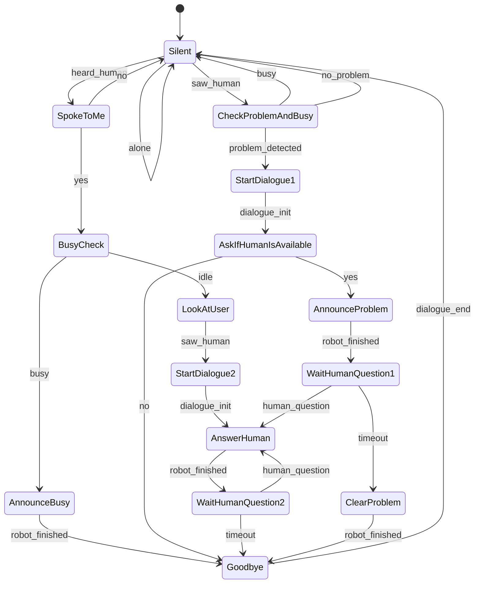
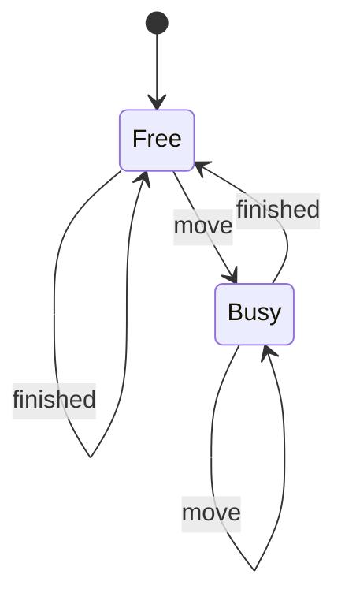
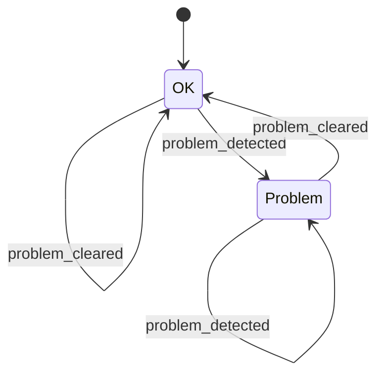
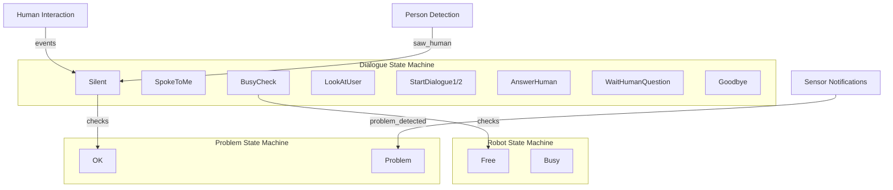

# State Machines Diagram

## Plantroid Dialogue State Machine

```mermaid
stateDiagram-v2
    [*] --> Silent

    Silent --> Silent: alone
    Silent --> CheckProblemAndBusy: saw_human
    Silent --> SpokeToMe: heard_human

    SpokeToMe --> Silent: no
    SpokeToMe --> BusyCheck: yes

    BusyCheck --> LookAtUser: idle
    BusyCheck --> AnnounceBusy: busy

    LookAtUser --> StartDialogue2: saw_human

    AnnounceBusy --> Goodbye: robot_finished

    StartDialogue2 --> AnswerHuman: dialogue_init

    AnswerHuman --> WaitHumanQuestion2: robot_finished

    WaitHumanQuestion1 --> AnswerHuman: human_question
    WaitHumanQuestion1 --> ClearProblem: timeout

    CheckProblemAndBusy --> Silent: busy
    CheckProblemAndBusy --> Silent: no_problem
    CheckProblemAndBusy --> StartDialogue1: problem_detected

    StartDialogue1 --> AskIfHumanIsAvailable: dialogue_init

    Goodbye --> Silent: dialogue_end

    AskIfHumanIsAvailable --> AnnounceProblem: yes
    AskIfHumanIsAvailable --> Goodbye: no

    AnnounceProblem --> WaitHumanQuestion1: robot_finished

    WaitHumanQuestion2 --> AnswerHuman: human_question
    WaitHumanQuestion2 --> Goodbye: timeout

    ClearProblem --> Goodbye: robot_finished
```

## Plantroid Robot State Machine

```mermaid
stateDiagram-v2
    [*] --> Free

    Free --> Busy: move
    Free --> Free: finished

    Busy --> Busy: move
    Busy --> Free: finished
```

## Plantroid Problem State Machine

```mermaid
stateDiagram-v2
    [*] --> OK

    OK --> Problem: problem_detected
    OK --> OK: problem_cleared

    Problem --> Problem: problem_detected
    Problem --> OK: problem_cleared
```

## Combined System Overview

```mermaid
graph TB
    subgraph Dialogue["Dialogue State Machine"]
        D1[Silent]
        D2[SpokeToMe]
        D3[BusyCheck]
        D4[LookAtUser]
        D5[StartDialogue1/2]
        D6[AnswerHuman]
        D7[WaitHumanQuestion]
        D8[Goodbye]
    end

    subgraph Robot["Robot State Machine"]
        R1[Free]
        R2[Busy]
    end

    subgraph Problem["Problem State Machine"]
        P1[OK]
        P2[Problem]
    end

    D3 -->|checks| R1
    D1 -->|checks| P1
    SENSOR[Sensor Notifications] -->|problem_detected| P2
    HUMAN[Human Interaction] -->|events| D1
    VISION[Person Detection] -->|saw_human| D1
```

